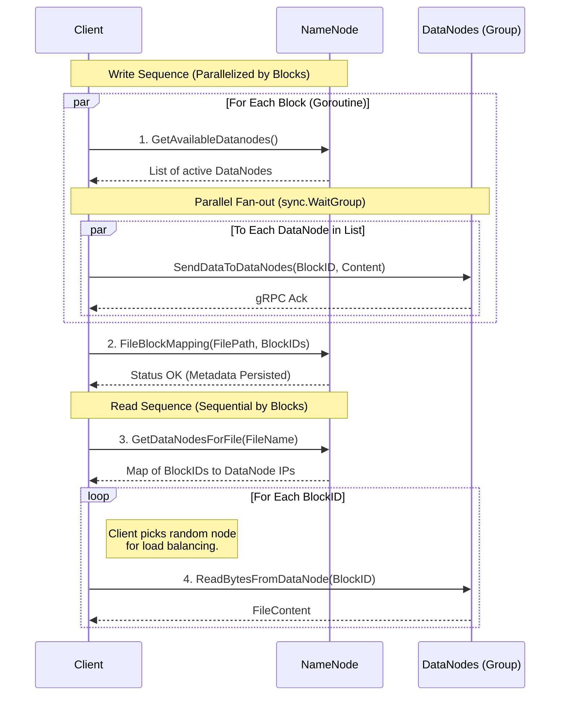

# GoDFS: Distributed File System


**GoDFS** is a fault-tolerant distributed file system implementation inspired by the **Hadoop Distributed File System (HDFS)**. Built entirely in **Golang**, it leverages **gRPC** for low-latency inter-node communication and Protocol Buffers for efficient data serialization.

---

## Distributed Systems Design & Implementation

* **Distributed Systems Architecture**: Decouples metadata management (**NameNode**) from physical storage (**DataNode**) for horizontal scaling.
* **Automatic Replication**: Implements data durability by replicating file chunks across multiple nodes, ensuring zero data loss during individual node failure.
* **Chunk-Based Storage**: Handles files larger than single-node capacity by partitioning data into discrete, manageable blocks.
* **High Concurrency**: Leverages Go’s concurrency model (Goroutines/Channels) for non-blocking I/O and simultaneous client requests.
* **Optimized RPC**: Uses **gRPC over HTTP/2** with Protocol Buffers for low-latency, strictly-typed inter-node communication.

---

## System Components

| Component | Responsibility |
| :--- | :--- |
| **NameNode** | The central authority; manages metadata, chunk mapping, and node health. |
| **DataNode** | The storage engine; handles physical block I/O and cross-node replication. |
| **Client** | Orchestrates file splitting and communicates directly with DataNodes for streaming. |

---


---

## Tech Stack

* **Language:** Go (Golang)
* **RPC Framework:** gRPC
* **Serialization:** Protocol Buffers (Protobuf)
* **Build Tool:** GNU Make

---

## Getting Started

### Prerequisites
* Go 1.18+
* Protobuf Compiler (`protoc`)

### Installation & Setup

1.  **Clone the repository**
    ```bash
    git clone [https://github.com/SuhasR3/GoDFS.git](https://github.com/SuhasR3/GoDFS.git)
    cd GoDFS
    ```

2.  **Generate Protobuf Definitions**
    Compiles the `.proto` files into Go code for gRPC services.
    ```bash
    make protoc
    ```

### Running the Cluster

The system is designed to run as a cluster of processes. Open separate terminal instances for each component:

**1. Start the NameNode (Master)**
```bash
make run-namenode
```
**2. Start DataNodes (Workers) Spin up the storage nodes to begin accepting chunks.**
```bash
make run-datanodes
```
**3. Perform Write Operations (Client) Simulate a client uploading a file to the distributed system.**
```bash
make run-client-write
```
**4. Perform Read Operations (Client) Simulate a client retrieving a file from the distributed system.**
```bash
make run-client-read
```
