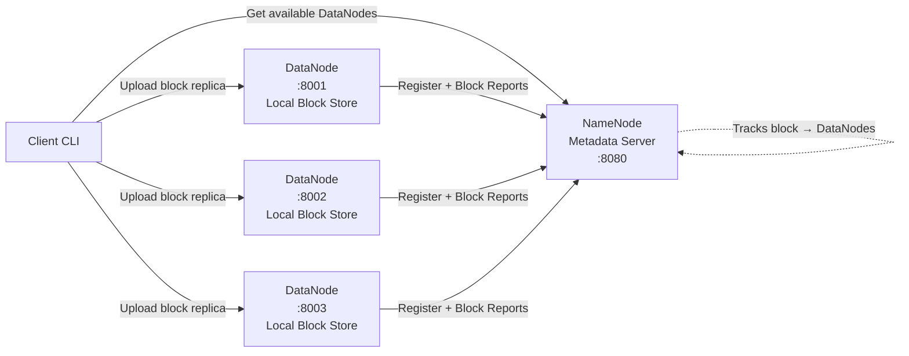
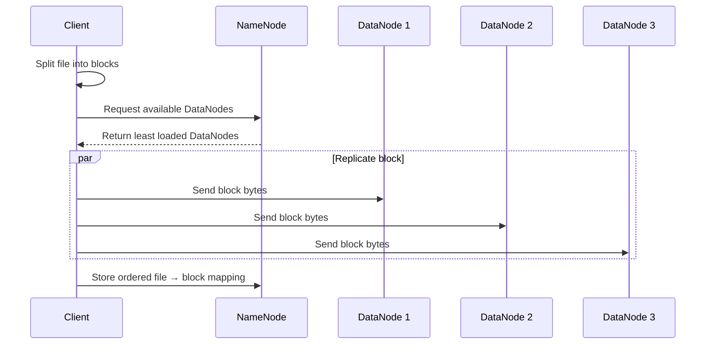
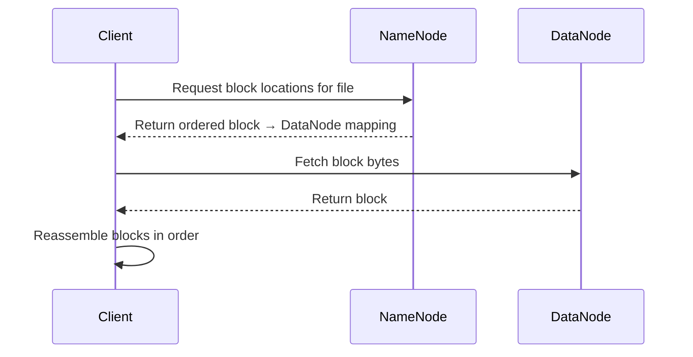

# GoDFS: Distributed File System in Go


GoDFS is a distributed file system built in Go, modeled on the core architecture of the Hadoop Distributed File System (HDFS). It splits files into fixed size blocks, replicates each block 3x across multiple storage nodes, and uses a central metadata server to track where every block lives. The system has three components: a NameNode for metadata, multiple DataNodes for block storage, and a Client that coordinates reads and writes over gRPC with Protocol Buffers.

---

## Architecture


```mermaid
flowchart LR
    Client[Client CLI]

    NameNode[NameNode<br/>Metadata Server<br/>:8080]

    DN1[DataNode<br/>:8001<br/>Local Block Store]
    DN2[DataNode<br/>:8002<br/>Local Block Store]
    DN3[DataNode<br/>:8003<br/>Local Block Store]

    Client -->|Get available DataNodes| NameNode
    Client -->|Upload block replica| DN1
    Client -->|Upload block replica| DN2
    Client -->|Upload block replica| DN3

    DN1 -->|Register + Block Reports| NameNode
    DN2 -->|Register + Block Reports| NameNode
    DN3 -->|Register + Block Reports| NameNode

    NameNode -.->|Tracks file → blocks| NameNode
    NameNode -.->|Tracks block → DataNodes| NameNode
```

---

## Backend Engineering Highlights

- **Distributed storage architecture** with separate Client, NameNode, and DataNode services.
- **gRPC and Protocol Buffers** for typed, schema validated communication between services, with generated client and server stubs.
- **Block based file storage** where files are split into smaller chunks before being written.
- **3x block replication** across DataNodes.
- **Concurrent write path** using goroutines and `sync.WaitGroup` at two levels: one goroutine per block, and one goroutine per replica inside each block.
- **DataNode self registration** with UUID based node identity.
- **Periodic block reports** from DataNodes to the NameNode every 10 seconds.
- **Load aware placement** by assigning new blocks to the least loaded available DataNodes.

---

## Design Choices

- **Centralized metadata:** The NameNode stores file to block and DataNode to block mappings in memory, keeping file lookup simple and close to the HDFS model.
- **Replica based writes:** Each block is written to three DataNodes, separating logical file metadata from physical block storage.
- **Greedy load balancing:** The NameNode sorts available DataNodes by current block count and chooses the least loaded nodes for new writes.
- **Local disk block storage:** Each DataNode stores blocks as individual files under its own UUID based directory.

---

## Write Path


```mermaid
sequenceDiagram
    participant C as Client
    participant N as NameNode
    participant D1 as DataNode 1
    participant D2 as DataNode 2
    participant D3 as DataNode 3

    C->>C: Split file into blocks
    C->>N: Request available DataNodes
    N-->>C: Return least loaded DataNodes

    par Replicate block
        C->>D1: Send block bytes
        C->>D2: Send block bytes
        C->>D3: Send block bytes
    end

    C->>N: Store ordered file → block mapping
```

When writing a file, the client splits it into fixed size blocks and uploads each block in parallel. For every block, the client requests available DataNodes from the NameNode, writes the block to three replicas, then records the final ordered block list with the NameNode.

---

## Read Path


```mermaid
sequenceDiagram
    participant C as Client
    participant N as NameNode
    participant D as DataNode

    C->>N: Request block locations for file
    N-->>C: Return ordered block → DataNode mapping
    C->>D: Fetch block bytes
    D-->>C: Return block
    C->>C: Reassemble blocks in order
```

When reading a file, the client asks the NameNode for the file's ordered block list and the DataNodes that store each block. The client then fetches one replica per block and reconstructs the file in order.

---

## Tech Stack

- **Language:** Go
- **RPC:** gRPC
- **Serialization:** Protocol Buffers
- **Concurrency:** Goroutines, channels, `sync.WaitGroup`
- **Storage:** Local disk block files
- **Build:** Makefile
- **Containerization:** Docker

---

## Run Locally

Start the NameNode:

```bash
./go-dfs namenode -port 8080 -block-size 32
```

Start DataNodes:

```bash
./go-dfs datanode -port 8001 -location datanode-files
./go-dfs datanode -port 8002 -location datanode-files
./go-dfs datanode -port 8003 -location datanode-files
```

Write a file to the cluster:

```bash
./go-dfs client -namenode 8080 -operation write -source-path . -filename big.txt
```

Read a file from the cluster:

```bash
./go-dfs client -namenode 8080 -operation read -source-path . -filename big.txt
```

---

## Current Scope

GoDFS is a local distributed systems prototype. The NameNode stores metadata in memory, and DataNodes persist block files to local disk.

---

## Roadmap

- **NameNode persistence** via a write ahead log or periodic snapshot, so file metadata survives a restart.
- **DataNode failure detection** via heartbeat timeout, so dead nodes leave the available pool and reads route around them.
- **Thread safety** with a mutex around the NameNode maps to remove the data race under concurrent writes and block reports.
- **TLS** on all gRPC connections in place of the current insecure credentials.
