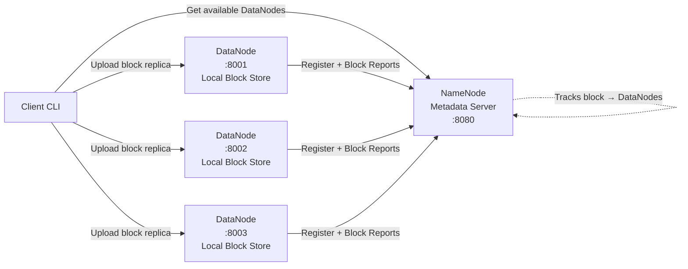
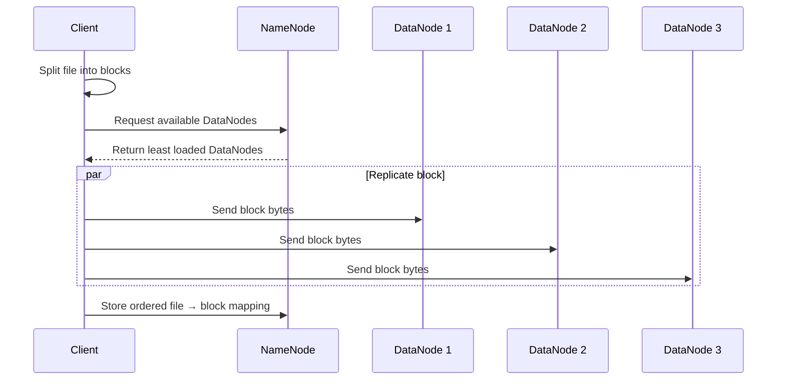
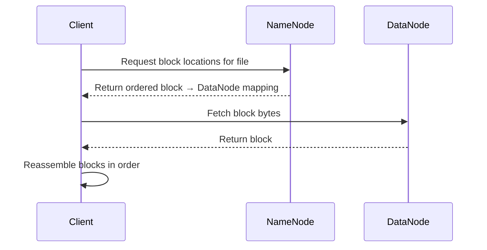

# GoDFS: Distributed File System

> The core of HDFS, built from scratch in Go. A live cluster of independent services that split files into replicated blocks and coordinate every read and write over gRPC.


GoDFS is a multi process distributed file system modeled on the architecture of the Hadoop Distributed File System. A central NameNode owns all file metadata. A pool of DataNodes stores file blocks on local disk and reports in every 10 seconds. A client splits each file into fixed size blocks, fans them across three DataNodes in parallel, and records the ordered block layout with the NameNode. Every component is its own process, and all of them talk over gRPC with Protocol Buffers.

---

## What this demonstrates

- **Coordinating state across independent services:** a metadata server, a pool of storage nodes, and a client, each its own gRPC process.
- **Block replication and load aware placement:** every block is written to three nodes, chosen by a least loaded policy.
- **Concurrent IO:** writes fan out across blocks and replicas at the same time, then reassemble in order.
- **Typed service contracts:** schema first gRPC and Protocol Buffers with generated stubs across three service types.

---

## Architecture


```mermaid
flowchart LR
    Client[Client CLI]

    NameNode[NameNode<br/>Metadata Server<br/>:8080]

    DN1[DataNode<br/>:8001<br/>Local Block Store]
    DN2[DataNode<br/>:8002<br/>Local Block Store]
    DN3[DataNode<br/>:8003<br/>Local Block Store]

    Client -->|Get available DataNodes| NameNode
    Client -->|Upload block replica| DN1
    Client -->|Upload block replica| DN2
    Client -->|Upload block replica| DN3

    DN1 -->|Register + Block Reports| NameNode
    DN2 -->|Register + Block Reports| NameNode
    DN3 -->|Register + Block Reports| NameNode

    NameNode -.->|Tracks file → blocks| NameNode
    NameNode -.->|Tracks block → DataNodes| NameNode
```

The NameNode never touches block bytes. It hands the client a set of target DataNodes, and the client streams block data straight to them. Metadata and data move on separate paths.

---

## Highlights

- **Two level write parallelism.** One goroutine per file block, and one goroutine per replica inside each block, so a three replica write issues all of its RPCs at once.
- **Scales to a 10 node cluster** with 3x replication on every block.
- **Load aware placement.** The NameNode sorts available nodes by block count and sends new blocks to the least loaded ones.
- **Ordered reassembly.** Results from parallel goroutines arrive out of order, get collected over a buffered channel, and are sorted by block index before the layout is committed.
- **DataNode self registration** with a UUID identity, plus a full block report every 10 seconds to keep metadata current.
- **gRPC over HTTP/2** with Protocol Buffers and generated client and server stubs.

---

## How it works

### Write path


```mermaid
sequenceDiagram
    participant C as Client
    participant N as NameNode
    participant D1 as DataNode 1
    participant D2 as DataNode 2
    participant D3 as DataNode 3

    C->>C: Split file into blocks
    C->>N: Request available DataNodes
    N-->>C: Return least loaded DataNodes

    par Replicate block
        C->>D1: Send block bytes
        C->>D2: Send block bytes
        C->>D3: Send block bytes
    end

    C->>N: Store ordered file → block mapping
```

The client splits the file into fixed size blocks and uploads them in parallel. For each block it asks the NameNode for three available DataNodes, writes the bytes to all three at once, and collects the results. Once every block is stored, it sends the ordered block layout to the NameNode in a single call.

### Read path


```mermaid
sequenceDiagram
    participant C as Client
    participant N as NameNode
    participant D as DataNode

    C->>N: Request block locations for file
    N-->>C: Return ordered block → DataNode mapping
    C->>D: Fetch block bytes
    D-->>C: Return block
    C->>C: Reassemble blocks in order
```

To read, the client asks the NameNode for the file's ordered block list and the nodes that hold each block. It fetches one replica per block, then reassembles the blocks in order.

---

## Design decisions

- **Centralized in memory metadata.** The NameNode holds the file to block and block to node maps in memory, which keeps lookups simple and mirrors the HDFS model.
- **Replica based writes.** Each block lands on three DataNodes, separating logical file metadata from physical block storage.
- **Greedy least loaded placement.** Block count is the placement signal, so new writes go to the emptiest nodes.
- **gRPC over plain TCP.** Typed, versioned RPC with generated stubs instead of a custom wire format.
- **Flat block files on local disk.** Each DataNode stores blocks as individual files under its own UUID namespaced directory.

---

## Tech stack

| Area | Choice |
|---|---|
| Language | Go 1.21 |
| RPC | gRPC over HTTP/2 |
| Serialization | Protocol Buffers |
| Concurrency | goroutines, channels, `sync.WaitGroup` |
| Identity | `google/uuid` for node and block IDs |
| Storage | flat block files on local disk |
| Build and run | Make, Docker (multi stage build) |

---

## Run it locally

Start the NameNode:

```bash
./go-dfs namenode -port 8080
```

Start three DataNodes:

```bash
./go-dfs datanode -port 8001 -location datanode-files
./go-dfs datanode -port 8002 -location datanode-files
./go-dfs datanode -port 8003 -location datanode-files
```

Write a file to the cluster:

```bash
./go-dfs client -namenode 8080 -operation write -source-path . -filename big.txt
```

Read it back:

```bash
./go-dfs client -namenode 8080 -operation read -source-path . -filename big.txt
```

---

## Roadmap

GoDFS runs as a local cluster today, with metadata held in memory and blocks on local disk. Next:

- **Persistence.** A write ahead log or snapshot so file metadata survives a NameNode restart.
- **Failure detection.** Heartbeat timeouts so dead DataNodes leave the pool and reads route around them.
- **Thread safety.** A mutex around the NameNode maps for safe concurrent writes and reports.
- **TLS.** Encrypted gRPC in place of the current insecure credentials.

---

## Credits

Modeled on the Hadoop Distributed File System. Licensed under MIT.
